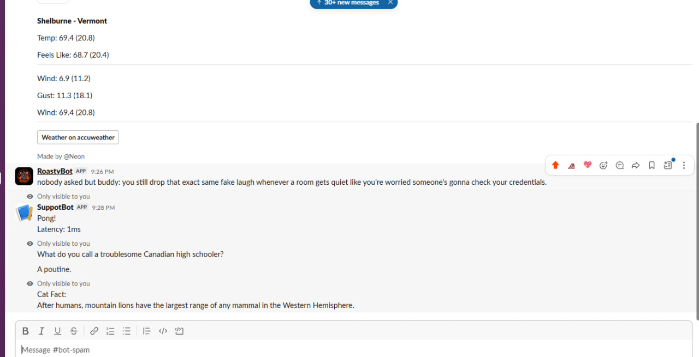

#Solar - Slackbot

My **SolarBot** can give us simple answers for commands. I spent it 2hours but hackatime didn't count my all hours. While setting up Nest, I have a bit struggle with it, and I ask for my friend to help. With his instructions, I have done it more easily.

This bot has 4 commands for now. 
1./supportbot-ping. for check 
2./supportbot-catfact - give random catfact.
3./supportbot-joke - random joke.

 
 
[Link to try SolarBot](https://hackclub.enterprise.slack.com/archives/C0BSP06K51P )
